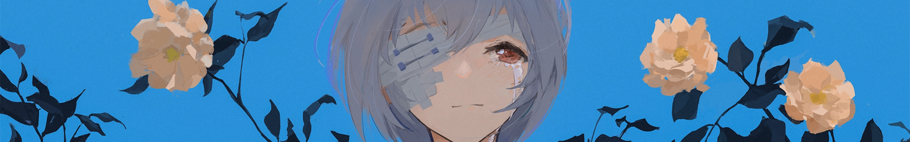

## Hi there 👋 I am a Flutter developer from China ❤ Practice duration of two and a half years

<!-- is a ✨ _special_ ✨ repository because its `README.md` (this file) appears on your GitHub profile.
- 🔭 I’m currently working on ...

- 👯 I’m looking to collaborate on ...
- 🤔 I’m looking for help with ...
- 💬 Ask me about ...
- 📫 How to reach me: ...
- 😄 Pronouns: ...
- ⚡ Fun fact: ...
-->

- 🌱 I’m currently learning Flutter&Harmony&Android 
  
- 📫 How to reach me: 210014468@qq.com
  
- ⚡ Fun fact: This is my second year of studying, and I still need to learn a lot of knowledge in this area. I have published two packages on pub.dev, <a href="https://pub.dev/packages/sliver_head_automatic_adsorption">'sliver_head_automatic_adsorption'</a> and <a href="https://pub.dev/packages/flutter_progress_bar_button">'flutter_progress_bar_button'</a>, which were created during my learning process. And the <a href="https://github.com/fluttercandies">"FlutterCandies"</a> software developed with the help of everyone in the <a href="https://github.com/fluttercandies/flutter_novel">"flutter_novel"</a> community

